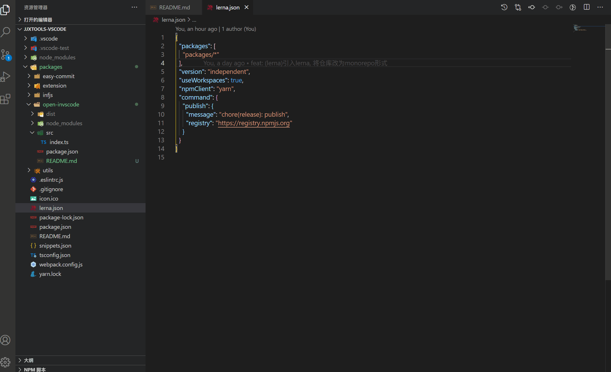
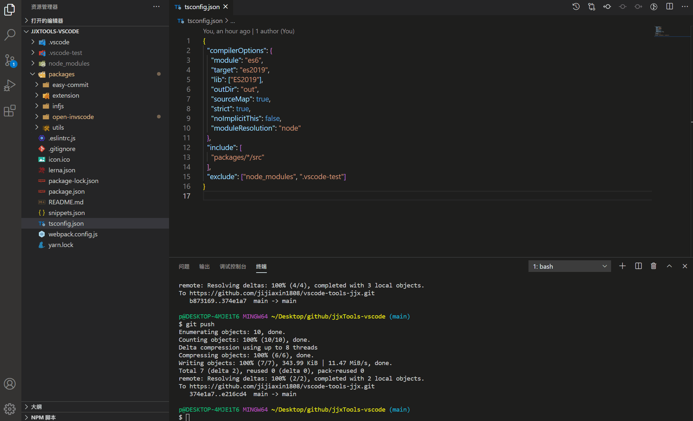
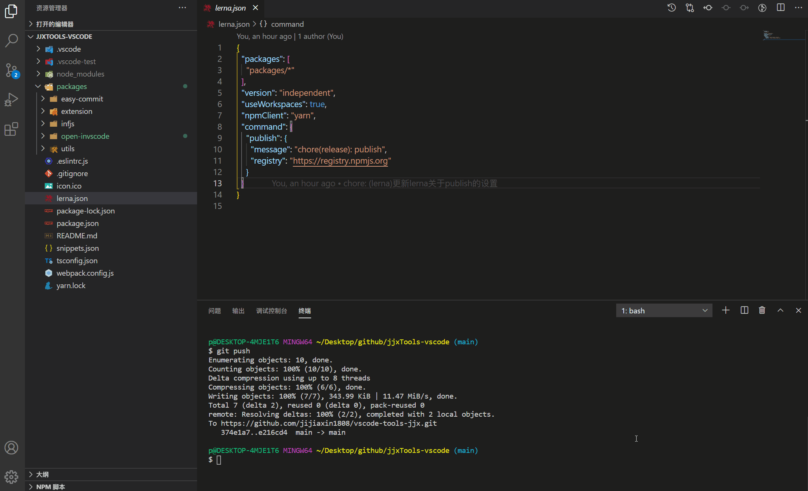

#  open-invscode

this extenison was created to open file/fold in a new vscode instance  

### directives

| directives | function | key-bind |
| --- | --- | --- |
| openfile | open the file  you are ediing  | ctrl + alt(cmd) + o|
| openfolder | open folder  you selected on explorer | ctrl + alt(cmd) + m|
|selectfolder | open folder where you selectd folder in folders picker | undefined |

### demos
#### openfile demo

 
 

#### openfolder demo

#### openfolder demo
